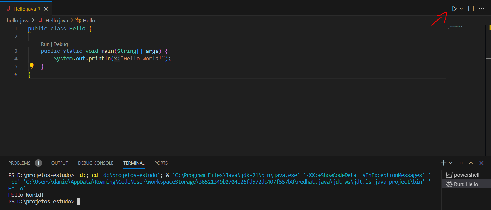

# Ambiente de desenvolvimento Java e SpringBoot com VsCode

Quem está estudando ou quer iniciar um projeto em Java, precisa antes de tudo ter um ambiente de desenvolvimento preparado para rodar seus projetos. Principalmente para quem está começanco a estudar, pode surgir muitas dúvidas, justamente por ter várias alternativas de IDE, plugins e diversas versões do Java. Até mesmo um simples "Hello World" pode se tornar complicado.
A escolha que fiz de utilizar o VSCode foi por já utilizar o mesmo no desenvolvimento de outras linguagens, principalmente NodeJs e Angular, já estando mais familiarizado com essa IDE, com plugins que já utilizo, além de deixar a máquina menos carregada, alternando entre projetos na mesma IDE.

## O que vamos precisar
- Java JDK (Java Development Kit) - É um pacote com ferramentas de desenvolvimento responsáveis por compilar e executar os projetos escritos em Java. Pode ser baixado no site da Oracle e atualmente está na versão 21. Possui versões para Windows, Linux e MAC.

- IDE (Integrated Developer Environment) - É o ambiente de desenvolvimento, onde vamos escrever os códigos. Além de editor a IDE traz muitas funcionalidades e plugins para facilitar todo o desenvolvimento. Temos muitas alternativas, dentre elas o IntelliJ IDEA, o Eclipse, o VSCode e vários outros. Todos são ou pelo menos possuem uma versão gratuita. A configuração a seguir será utilizando o VSCode.

- Plugins ou Extensões
    - Extension Pack for Java
    - Spring Boot Extension Pack

## Instalação e configuração
 - VSCode 1.83
    Podemos baixar o VSCode do site `https://code.visualstudio.com/`. Ele possui versão para Windows, Mac e Linux. A instalação é bem simples

    

 - Java JDK 21
    Também baixar e fazer a instalação conforme o sistela operacional utilizado
    https://www.oracle.com/br/java/technologies/downloads/

    

Agora vamos testar o Java para ver se foi instalado corretamente. Talvez seja necessário reiniciar o computador, ou apenas fechar e abrir o terminal utilizado. Vou testar aqui usando o terminal do VSCode.
Abra o VSCode e em seguida clique no menu "View" -> "Terminal" ou através da tecla de atalho CTRL+' (no Windows). Com o terminal do VSCode aberto, veja as versões do java e do seu compilador (javac) conforme imagem abaixo:


Se tudo estiver certo até aqui, o terminal irá retornar a versão 21 do Java e podemos prosseguir com a configuração do VSCode.

 - Extensões do VSCode

 A primeira extensão que vamos instalar é o `Extension Pack for Java` da Microsoft. Abra o painel de extensões através dos ícones da barra lateral ou n menu "View" -> "Extensions". Procure o pacote pelo seu nome e clique no botão de instalar

 

 Esse pack é um conjunto de extensões para auxiliar o desenvolvimento em Java no VSCode, reconhecendo e formatando os arquivos, habilitando o autocompletar, debug de código, execução de testes, gerenciamento de dependências e até mesmo a execução do projeto.
 Para testar, vamos fazer o "Hello World!". Crie uma pasta com um arquivo chamado `Hello.java` e coloque o código abaixo:

 ```java
 public class Hello {
    public static void main(String[] args) {
        System.out.println("Hello World!");
    }
}
```

Clique em "Run" ou no botão de execução conforme imagem abaixo:

 

 Se tudo ocorreu certo, o terminal irá mostrar a mensagem do "Hello World!"

 Agora vamos instalar a extensão para o Sprint Boot. No painel de extensões, procure po "Spring Boot Extension Pack" da VMware e faça a instalação.

 

 Para testar vamos criar um projeto usando o Sprint Boot Initializr que faz parte do pacote instalado. 
 - Clique no menu "View" -> "Command Palette..." ou pelo atalho CTRL+SHIFT+P e pesquise por "Sprint Initializr: Create a Maven Project..."
  - Selecione a versão do Spring Boot (estou usando a 3.1.4)
  - Seleciona a linguagem, no caso o Java
  - Informe o Group Id ou nome do pacote "com.example"
  - E o Artifact Id, como "hello"
  - Tipo do pacote (jar)
  - Versão do Java (21)
  - Agora vamos selecionar as dependências, para criar um projeto simples e validar a instalação, vou selecionar apenas o "Sprint Web" e o "Spring Bot DevTools"
  - Informe o diretório onde será criado o projeto, se necessário crie um diretório novo

  Pronto, o projeto está criado

  

  Para iniciar o projeto, abra o "Spring Boot Dashboard", veja o app hello na lista de apps e clique no botão de executar. Aguarde até a inicialização terminar, veja as mensagens no terminal

  

  Abra o navegador na url `http://localhost:8080/` e veja o retorno da aplicação

  

  A aplicação retorna um erro 404, porque realmente não foi criada nenhuma página, mas isso já seria o suficiente para dizer que a instalação está funcionando.
  Para finalizar, vamos criar uma página com o "Hello World!".
  Crie o arquivo HelloController.java dentro o mesmo diretório que está o HelloApplication.java. Copie ou escreva o código abaixo:

  ```java
    package com.example.hello;
    import org.springframework.web.bind.annotation.GetMapping;
    import org.springframework.web.bind.annotation.RestController;

    @RestController
    public class HelloController {
        @GetMapping
        public String hello() {
            return "Hello World!";
        }
    }
  ```

  Graças ao Spring Boot Tools que foi instalado no pacote de extensões, aplicação detecta as alterações e reinicia o serviço. Acompanhe os logs para verificar qualquer erro.
  Atualize a página do navegador para ver o "Hello World!"

  

## Considerações finais
A escolha da IDE é um pouco pessoal, desde que instalada e configurada corretamente. Acho até importante para quem está estudando, testar as mais populares e ver o que prefere. Muitas vezes no trabalho, usando notebook da empresa não temos a possibilidade de escolher a ferramenta preferida, e temos que usar o que temos, por isso é importante antes de tudo entender o que está sendo feito, o papel de cada componente e saber se adaptar, aproveitar as oportunidades para estar sempre aprendendo algo novo.
